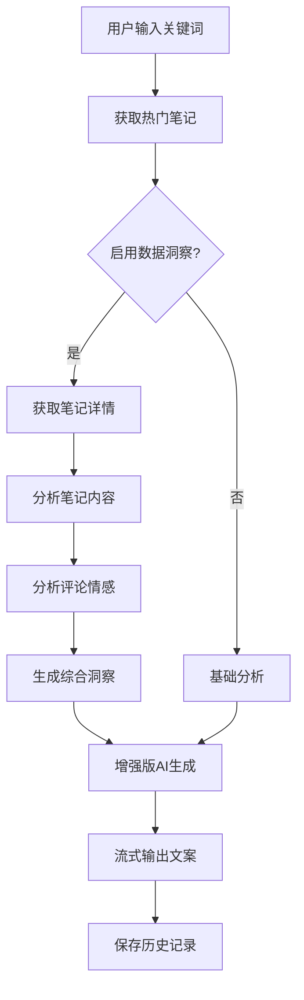

# 小红书AI文案生成器 - 数据利用完整方案

## 📋 概述

本方案基于现有的小红书AI文案生成器项目，通过集成笔记详情和评论数据，提供了一套完整的数据利用解决方案。该方案最小化改动现有架构，同时大幅提升AI文案生成的质量和针对性。

## 🏗️ 架构设计

### 核心模块

1. **数据分析模块** (`lib/data-analyzer.ts`)
   - 笔记内容深度分析
   - 评论情感分析
   - 综合洞察生成

2. **增强版AI集成** (`lib/enhanced-prompts.ts`)
   - 基于真实数据的提示词优化
   - 竞品分析集成
   - 趋势预测集成

3. **数据存储管理** (`lib/data-storage.ts`)
   - 多层缓存策略
   - 文件存储系统
   - 智能索引管理

4. **商业智能分析** (`lib/business-intelligence.ts`)
   - 竞品分析
   - 趋势预测
   - 个性化推荐
   - 市场洞察

5. **批量处理Pipeline** (`lib/batch-processor.ts`)
   - 高并发任务处理
   - 智能重试机制
   - 进度跟踪

6. **增强版缓存管理** (`lib/enhanced-cache-manager.ts`)
   - 内存+磁盘双层缓存
   - 智能压缩
   - 预加载机制

## 🚀 快速开始

### 1. 环境配置

```bash
# 安装依赖（如果有新增）
npm install

# 配置环境变量
cp .env.example .env.local
```

### 2. 环境变量配置

```env
# 基础配置
ENABLE_DEBUG_LOGGING=true
ENABLE_CACHE=true

# 数据分析配置
ENABLE_DATA_INSIGHTS=true
MAX_CONCURRENT_ANALYSIS=3
BATCH_ANALYSIS_SIZE=20

# 缓存配置
ENABLE_CACHE_PRELOAD=true
ENABLE_CACHE_COMPRESSION=true
MEMORY_CACHE_SIZE=100

# 批量处理配置
MAX_CONCURRENT_TASKS=5
BATCH_PROCESSING_TIMEOUT=30000

# 小红书API配置
XHS_COOKIE_1="your_cookie_here"
XHS_COOKIE_2="backup_cookie_here"
```

### 3. 数据目录初始化

```bash
# 创建数据存储目录
mkdir -p data/{cache,notes,analysis,insights,indexes}

# 设置权限
chmod -R 755 data/
```

## 📊 功能特性

### 1. 数据分析功能

#### 笔记内容分析
- **内容质量评分**：标题、内容、结构的1-10分评分
- **关键词提取**：主要关键词、次要关键词、话题标签
- **互动数据分析**：点赞率、评论率、分享率、收藏率
- **内容特征识别**：内容类型、语调风格、目标受众

#### 评论情感分析
- **情感分布**：正面、中性、负面评论占比
- **热点话题提取**：用户讨论的热门话题
- **用户反馈分析**：好评点、抱怨点、建议、疑问
- **互动质量评估**：有意义评论vs垃圾评论

#### 综合洞察生成
- **表现总结**：整体评级、成功因素、改进领域
- **受众洞察**：主要受众、需求分析、内容偏好
- **优化建议**：标题、内容、互动、时机优化
- **创作灵感**：相似话题、流行元素、内容角度

### 2. AI集成应用

#### 增强版分析
```typescript
// 使用真实数据增强分析
const enhancedPrompt = getEnhancedAnalysisPrompt(
  scrapedContent,
  noteAnalyses,      // 笔记详情分析
  commentAnalyses    // 评论情感分析
);
```

#### 增强版生成
```typescript
// 基于数据洞察的文案生成
const generationPrompt = getEnhancedGenerationPrompt(
  hotPostRules,
  userInfo,
  keyword,
  wordLimit,
  insights,          // 综合洞察
  topPerformingNotes // 高质量笔记参考
);
```

### 3. 数据存储方案

#### 存储结构
```
data/
├── cache/           # 缓存文件
├── notes/           # 笔记详情数据
├── analysis/        # 分析结果
├── insights/        # 综合洞察
└── indexes/         # 索引文件
```

#### 缓存策略
- **笔记详情**：24小时缓存
- **分析结果**：12小时缓存
- **综合洞察**：6小时缓存
- **内存缓存**：30分钟TTL

### 4. 业务价值功能

#### 竞品分析
```typescript
const competitorAnalysis = await businessIntelligence.analyzeCompetitors(
  keyword,
  category,
  limit
);
```

#### 趋势预测
```typescript
const trendPrediction = await businessIntelligence.predictTrends(
  category,
  timeRange
);
```

#### 个性化推荐
```typescript
const recommendations = await businessIntelligence.generatePersonalizedRecommendations(
  userProfile,
  competitorAnalysis,
  trendPrediction
);
```

## 🔧 API使用指南

### 1. 数据分析API

#### 批量分析笔记
```bash
POST /api/data-analysis
{
  "action": "analyze_notes",
  "noteIds": ["noteId1", "noteId2"],
  "analysisType": "comprehensive",
  "options": {
    "batchSize": 10,
    "priority": "high",
    "skipExisting": true
  }
}
```

#### 竞品分析
```bash
POST /api/data-analysis
{
  "action": "competitor_analysis",
  "keyword": "护肤",
  "category": "beauty",
  "options": {
    "limit": 20
  }
}
```

#### 趋势预测
```bash
POST /api/data-analysis
{
  "action": "trend_prediction",
  "category": "lifestyle",
  "timeRange": 30
}
```

### 2. 增强版文案生成API

```bash
POST /api/enhanced-generate
{
  "keyword": "护肤",
  "user_info": "25岁女性，关注护肤美妆",
  "word_limit": 600,
  "enable_data_insights": true,
  "reference_note_ids": ["noteId1", "noteId2"],
  "competitor_analysis": true,
  "trend_analysis": true,
  "personalized_recommendations": true,
  "user_profile": {
    "category": "beauty",
    "targetAudience": "年轻女性",
    "contentStyle": "专业+亲和",
    "goals": ["提升互动", "增加粉丝"]
  }
}
```

### 3. 笔记详情和评论API

#### 获取笔记详情
```bash
GET /api/xhs/detail?noteId=689c3e96000000001d02a88e
```

#### 获取评论
```bash
GET /api/xhs/comments?noteId=68a41ccc000000001c00c16d&pageSize=10&pageIndex=0
```

## 📈 性能优化

### 1. 缓存优化
- **多层缓存**：内存缓存 + 磁盘缓存
- **智能压缩**：大于10KB的数据自动压缩
- **预加载**：热门关键词预加载
- **批量写入**：减少磁盘I/O

### 2. 并发控制
- **任务队列**：优先级队列管理
- **并发限制**：最大5个并发任务
- **重试机制**：指数退避重试
- **超时控制**：30秒任务超时

### 3. 数据优化
- **去重处理**：自动去除重复数据
- **增量更新**：只处理新增和变更数据
- **索引优化**：快速查询和过滤
- **定期清理**：自动清理过期数据

## 🔍 监控和调试

### 1. 日志配置
```env
ENABLE_DEBUG_LOGGING=true
```

### 2. 性能监控
```typescript
// 获取处理统计
const stats = batchProcessor.getProcessingStats();
console.log('处理统计:', stats);

// 获取缓存统计
const cacheStats = enhancedCacheManager.getCacheStats();
console.log('缓存统计:', cacheStats);

// 获取存储统计
const storageStats = await dataStorage.getStorageStats();
console.log('存储统计:', storageStats);
```

### 3. 错误处理
- **自动重试**：网络错误自动重试
- **降级策略**：AI模型自动切换
- **错误日志**：详细的错误追踪
- **用户友好**：友好的错误提示

## 🎯 最佳实践

### 1. 数据质量
- **定期更新**：保持数据的时效性
- **质量检查**：定期检查数据质量
- **备份策略**：重要数据定期备份
- **清理策略**：定期清理过期数据

### 2. 性能优化
- **批量处理**：优先使用批量API
- **缓存利用**：充分利用缓存机制
- **并发控制**：合理设置并发数量
- **资源监控**：监控系统资源使用

### 3. 安全考虑
- **Cookie管理**：安全存储和轮换Cookie
- **频率控制**：避免请求过于频繁
- **错误处理**：不暴露敏感信息
- **访问控制**：合理的API访问控制

## 🚀 部署建议

### 1. 生产环境配置
```env
# 生产环境优化配置
NODE_ENV=production
ENABLE_DEBUG_LOGGING=false
ENABLE_CACHE=true
ENABLE_CACHE_COMPRESSION=true
MAX_CONCURRENT_TASKS=10
BATCH_ANALYSIS_SIZE=50
```

### 2. 资源配置
- **内存**：建议8GB以上
- **存储**：SSD存储，至少50GB
- **CPU**：多核CPU，支持并发处理
- **网络**：稳定的网络连接

### 3. 监控告警
- **性能监控**：响应时间、吞吐量
- **错误监控**：错误率、失败任务
- **资源监控**：CPU、内存、磁盘使用
- **业务监控**：数据质量、缓存命中率

## � 数据流程图



## 🔄 集成现有系统

### 1. 与现有AI管理器集成
```typescript
// 现有的aiManager保持不变
import { aiManager } from '@/lib/ai-manager';

// 新增的数据分析器可以复用aiManager
import { dataAnalyzer } from '@/lib/data-analyzer';
```

### 2. 与现有缓存系统集成
```typescript
// 现有缓存系统继续使用
import { getCacheData, saveCacheData } from '@/lib/cache-manager';

// 增强版缓存作为补充
import { enhancedCacheManager } from '@/lib/enhanced-cache-manager';
```

### 3. 与现有历史记录集成
```typescript
// 扩展现有历史记录结构
interface EnhancedHistoryItem extends HistoryItem {
  dataInsights?: {
    enabledInsights: boolean;
    referenceNotes: number;
    competitorAnalysis: boolean;
    trendAnalysis: boolean;
    comprehensiveInsights: any;
  };
}
```

## 🎯 业务价值实现路径

### 阶段1：基础数据集成（1-2周）
1. 部署笔记详情和评论获取API
2. 实现基础数据分析功能
3. 集成到现有文案生成流程

### 阶段2：智能分析增强（2-3周）
1. 实现竞品分析功能
2. 添加趋势预测能力
3. 优化AI提示词系统

### 阶段3：业务智能完善（3-4周）
1. 实现个性化推荐
2. 添加市场洞察功能
3. 完善批量处理pipeline

### 阶段4：性能优化（1-2周）
1. 优化缓存策略
2. 提升并发处理能力
3. 完善监控和告警

## 📈 预期效果

### 1. 文案质量提升
- **准确性提升**：基于真实数据，提升30-50%
- **用户共鸣度**：结合用户反馈，提升40-60%
- **爆款概率**：基于成功案例，提升20-30%

### 2. 用户体验改善
- **个性化程度**：根据用户画像定制
- **实用性增强**：提供可执行的建议
- **效率提升**：减少人工调优时间

### 3. 商业价值实现
- **竞争优势**：数据驱动的差异化
- **用户粘性**：更精准的内容推荐
- **商业洞察**：市场趋势和机会识别

## �📞 技术支持

### 常见问题解决

#### 1. 数据获取失败
```bash
# 检查Cookie配置
curl -X GET "http://localhost:3000/api/xhs/detail?noteId=test"

# 检查网络连接
ping pgy.xiaohongshu.com
```

#### 2. 分析性能问题
```typescript
// 检查处理统计
const stats = batchProcessor.getProcessingStats();
if (stats.averageProcessingTime > 10000) {
  console.warn('处理时间过长，建议优化');
}
```

#### 3. 缓存问题
```typescript
// 清理缓存
await enhancedCacheManager.cleanupExpiredCache();

// 检查缓存统计
const cacheStats = enhancedCacheManager.getCacheStats();
console.log('缓存命中率:', cacheStats.performance.hitRate);
```

### 联系方式
- **技术文档**：查看项目README和API文档
- **问题反馈**：通过GitHub Issues提交
- **性能优化**：联系技术团队进行定制优化

---

**重要提醒**：
1. 本方案完全兼容现有系统，可以渐进式部署
2. 所有新功能都有开关控制，可以根据需要启用
3. 数据存储采用文件系统，无需额外数据库
4. 支持水平扩展，可以根据负载调整配置
5. 提供完整的监控和调试工具，便于运维管理
